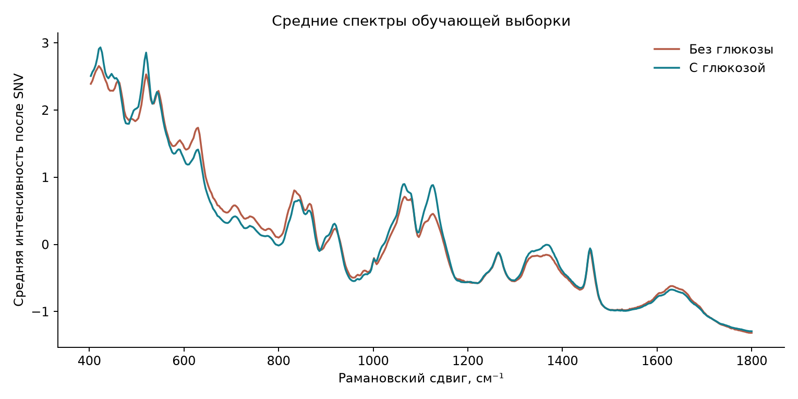
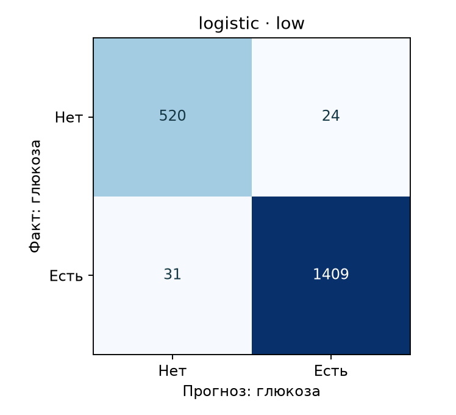

# Есть ли глюкоза в смеси четырёх сахаров?

Классификация измеренных рамановских спектров из набора [Raman_Sugars](https://github.com/Alvaro-FG/Raman_Sugars). Метка определяется рецептурой лунки: `Glucose [ul] > 0`. Это исследовательский эксперимент, а не медицинский классификатор.

## Результаты

| Модель | Проверка | Balanced accuracy | F1 | ROC AUC |
| --- | --- | ---: | ---: | ---: |
| Частый класс | 5 с | 0.500 | 0.841 | 0.500 |
| Частый класс | 0.5 с | 0.500 | 0.841 | 0.500 |
| Логистическая регрессия | 5 с | 1.000 | 1.000 | 1.000 |
| Логистическая регрессия | 0.5 с | 0.967 | 0.981 | 0.995 |
| Случайный лес | 5 с | 0.978 | 0.992 | 1.000 |
| Случайный лес | 0.5 с | 0.678 | 0.890 | 0.970 |

«Частый класс» всегда предсказывает наличие глюкозы. Из-за дисбаланса классов его F1 выглядит высоким, хотя balanced accuracy показывает отсутствие различения классов.

## Как устроена проверка

Все модели обучены только на измерениях с экспозицией 5 с. Разделение сделано **по физическим лункам**: тестовые лунки не попадают в обучение. На тех же тестовых лунках сравниваются экспозиции 5 с и 0.5 с. Это проверка более шумного сигнала тех же рецептур, а не нового прибора или неизвестного вещества.

Спектры обрезаны до 400–1800 см⁻¹ и нормализованы отдельно для каждого измерения (SNV). Масштабирование признаков логистической регрессии обучается только на тренировочной части.

Линейная модель сохранила высокую разделимость при короткой экспозиции и в этом опыте оказалась устойчивее случайного леса. Следующий эксперимент — разделение по дню приготовления или прибору, если появятся независимые партии измерений.

Сырые спектры здесь не публикуются; [скрипт загрузки](../src/fetch_data.py) закреплён на конкретной ревизии источника.

[PDF для скачивания](https://github.com/morenoler/raman-glucose-classification/raw/refs/heads/main/docs/report.pdf) · [Таблица метрик](../output/metrics.csv)
